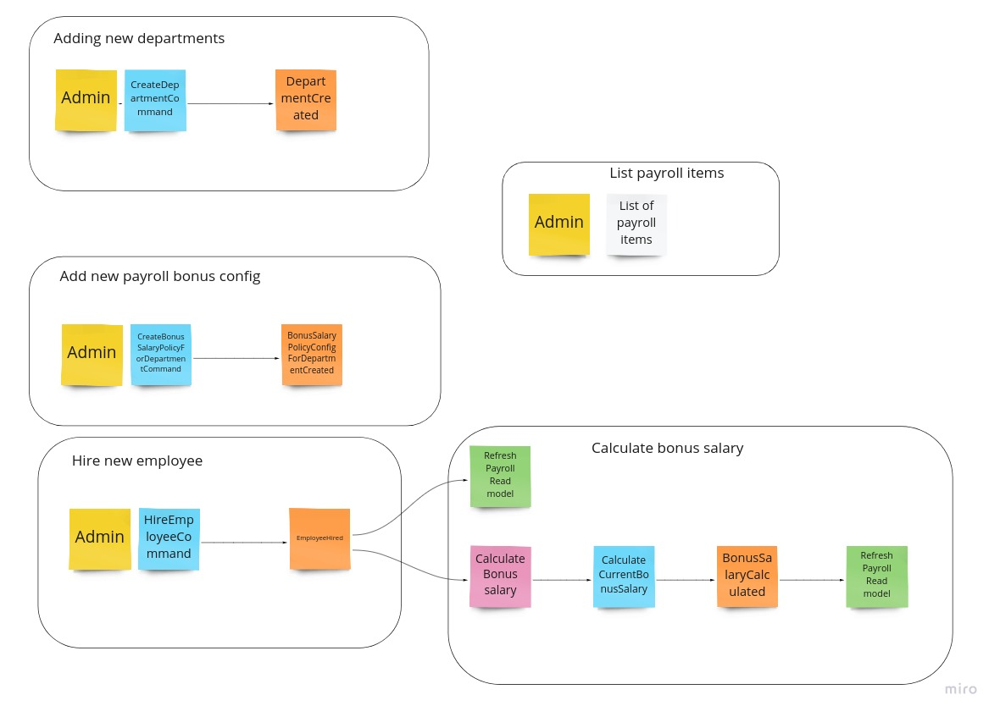

1. Schema of system processes:
   

2. How to run application:
   - docker-compose run --rm php composer install
   - docker-compose run --rm php bin/console doctrine:database:create
   - docker-compose run --rm php bin/console doctrine:database:create --env=test
   - docker-compose run --rm php composer tests
   - docker-compose run --rm php composer psalm
   - docker-compose run --rm php composer phpcs
   - docker-compose run --rm php bin/console payroll:create-task-description-data-command #populates database with task description data

3. Adding new departments:
   - docker-compose run --rm php bin/console department:create-department
 
4. Add new payroll bonus config:
   - docker-compose run --rm php bin/console payroll:create-bonus-salary-policy-for-department

5. Hire new employee:
   - docker-compose run --rm php bin/console employee:hire-employee

6. List payroll items:
   - docker-compose run --rm php  bin/console payroll:list-items

7. To cut some time I've made some assumptions:
   - I focused on Payroll bounded context, which means other contexts has not tests.
   - Department and Employee contexts have a very leaky facade, I used Domain layer by purpose.
   - Payroll bonus salary policy can be assigned to the department only once and can't be changed.
   - Every new Employee has a base salary of 1000.
   - Salary has no currency and.
   - Elasticsearch would fit better than SQL database for ReadModel.
   - Skip most of the tests of CLI commands.